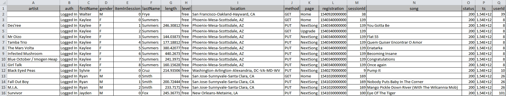

# cassandra_etl
Data modeling for NoSQL Apache Cassandra


## Project Introduction
A startup called Sparkify wants to analyze the data they've been collecting on songs and user activity on their new music streaming app. Currently, there is no easy way to query the data to generate the results, since the data reside in a directory of CSV files on user activity on the app.  

They'd like a data engineer to create an Apache Cassandra database which can create queries on song play data to answer the questions, and wish to bring you on the project. Your role is to create a database for this analysis. You'll be able to test your database by running queries given to you by the analytics team from Sparkify to create the results.  
  
  
## Project Goal
Do data modeling with **Apache Cassandra** and build an ETL pipeline using python. With given series of song play event logs data, consolidate into one CSV file which will be used for constructing Apache Casandra tables.  
**Apache Cassandra** is a NoSQL database specialized in fast reading.


#### 1. When to use NoSQL

  - Need High Availability
  - Have Large Amounts of Data
  - Need Linear Scalability
  - Low Latency
  - Need Fast Read and Write

#### 2. About Apache Cassandra

  - Open Source NoSQL database
  - Masterless Architecture
  - High Availability
  - Linearly Scalable
  - Used by Uber, Netflix, Hulu, Twitter, Facebook, etc
  - Major contributors to the project: DataStax, Facebook, Twitter, Apple

#### 3. Data Modeling in Apache Cassandra

  - Denormalization is not just okay -- it's a must
  - Denormalization must be done for fast reads
  - Apache Cassandra has been optimized for fast writes
  - Always think Queries first
  - One table per query is a great strategy
  - Apache Cassandra does not allow for JOINs between tables  


## Datasets

#### 1. Event Data
Only one type of data is given, which is event data. A directory of event CSV files partitioned by date. Here are filepaths to two sample files

```
>  event_data/2018-11-08-events.csv  
>  event_data/2018-11-09-events.csv
```

And below is what an event file looks like.
  


  
  

## Project Steps

#### 1. Pre-processing event logs into one denormalized and consolidated CSV file

  - Find paths to all event log files
  - Read and consolidate all events into `event_datafile_new.csv` file

#### 2. Consolidated `event_datafile_new.csv` will have columns
 
  - artist
  - firstName of user
  - gender of user
  - item number in session
  - last name of user
  - length of the song
  - level (paid or free song)
  - location of the user
  - sessionId
  - song title
  - userId
 
And below is an example of what event_datafile_new.csv looks like.


 
#### 3. Model Apache Cassandra database 
 
  - Create a Cluster
  - Create a Keyspace
  - Create tables
    * Need to model data based on 3 queries requested
  - Insert data into each table using `event_datafile_new.csv`
  - Verify data in each table
  
#### 4. Drop tables

#### 5. Close session and connection to cluster  

   

  
## Create tables

**3 queries** requested from Analyst team  

>    - Query 1.  Give me the artist, song title and song's length in the music app history that was heard during sessionId = 338, and itemInSession = 4
>    - Query 2. Give me only the following: name of artist, song (sorted by itemInSession) and user (first and last name) for userid = 10, sessionid = 182
>    - Query 3. Give me every user name (first and last) in my music app history who listened to the song 'All Hands Against His Own'


#### Table 1: song_play_by_session
For Query 1 : Give me the artist, song title and song's length in the music app history that was heard during sessionId = 338, and itemInSession = 4
```python
query1 = "SELECT artist, song, length FROM song_play_by_session WHERE sessionId=338 AND itemInSession=4"
```
This query is straight forward which requires **combination PK (sessionID, itemInSession)**  

  - column 1: sessionId  **<-- Partition Key**
  - column 2: itemInSession **<-- Clustering Column 1**
  - column 3: artist
  - column 4: song (song title)
  - column 5: length (length of song in seconds)
  - PRIMARY KEY: sessionId, itemInSession
  
  
#### Table 2: song_play_by_user
For Query 2 : Give me only the following: name of artist, song (sorted by itemInSession) and user (first and last name) for userid = 10, sessionid = 182
```python
query2 = "SELECT artist, song, first_name, last_name FROM song_play_by_user WHERE userId=10 AND sessionId=182"
```
This query is a little bit tricky because it requires **sorted by itemInSession** which must be a part of PK.  
So, the **PK becomes combination of (userId, sessionId, itemInSession)**, where itemInSession is not used in WHERE clause but implicitly affects the order of query output.  

  - column 1: userId  **<-- Partition Key**
  - column 2: sessionId  **<-- Clustering Column 1**
  - column 3: itsmInSession  **<-- Clustering Column 2**
  - column 4: artist
  - column 5: song
  - column 6: first_name
  - column 7: last_name
  - PRIMARY KEY: userId, sessionId, itemInSession

#### Table 3: user_by_song_played
For Query 3 : : Give me every user name (first and last) in my music app history who listened to the song 'All Hands Against His Own'
```python
query3 = "SELECT first_name, last_name FROM user_by_song_played WHERE song='All Hands Against His Own'"
```
This query requires output of user's first and last name. Since there can be **different users with the same first & last name**. We better use userId as a part of PK.  
So, the **PK becomes combination of (song, userId)**, where userId helps separating different users with the same first & last name

  - column 1: song  **<-- Partition Key**
  - column 2: userId  **<-- Clustering Column 1**
  - column 3: first_name
  - column 4: last_name  
  - PRIMARY KEY: song, userId  
  
  
## Run ETL

The ETL program is in **Project_1B_Project.ipynb** file which can be run in jupyter notebook.  
Please make sure you have locallay installed Apache Cassandra. If Apache Cassandra is running a remote box, please modify following code block.

```python
# This should make a connection to a Cassandra instance your local machine (127.0.0.1)
# If you have a Cassandra running on a remote machine, plesae change the IP address

from cassandra.cluster import Cluster
try:
    cluster = Cluster(['127.0.0.1'])
# To establish connection and begin executing queries, need a session
    session = cluster.connect()
except Exception as e:
    print(e)
```
